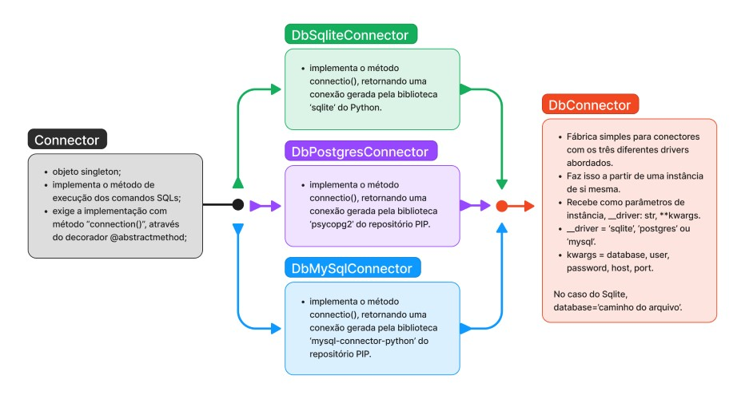

# DatabaseConnectors
Projeto de auxílio pedagógico no estudo de banco de dados e linguagem SQL e Python. Pretende facilitar a conexão com 
diferentes tipos de banco de dados durante o estudo de integração das linguagens Python e SQL. Permite conexão com
banco de dados Postgres, Mysql, Sqlite. Aqui também foi realizada uma tentativa de trabalho com padrões de projeto 
mais simples como o Singleton e o Simple Factory, sendo também um projeto de OOP(Programação orientada a objetos).

- Requerimentos
```shell
# mysql-connector-python, psycopg2, sqlite
pip install -r ./requirements.txt
```

## Princípios, estruturas, padrões do projeto

#### Padrão do objeto Connector:
- Singleton;

Singleton é um padrão de projeto cujo objetivo é garantir que apenas uma instância do objeto seja criada fornecendo
apenas um ponto de acesso global. Desta forma, quando há a necessidade de controlar o acesso a recursos compartilhados, 
como em conexões com banco de dados ou gerenciadores de configurações, ele pode ser uma opção viável de implementação.
É importante ressaltar que objetos Singleton representam uma única instância da classe, desta forma, instâncias
diferentes sobrescrevem seus dados, o quê pode gerar problemas de concorrência. O objeto Connector(), implementa 
este padrão e fornece um método abstrato que deverá retornar o conector específico para o driver desejado (PostgreSQL, 
MySQL, Sqlite). Ele também entrega, por herança, o método que executará as consultas no banco de dados. O objeto também 
permite a observação do princípio de aberto e fechado, permitindo a sua expansão, mas restringindo a sua modificação. 
```python
from abc import abstractmethod


class Connector:
    __instance = None

    def __new__(cls, *args, **kwargs):
        if not cls.__instance or cls.__instance is None:
            cls.__instance = super(Connector, cls).__new__(cls)
        return cls.__instance

    def __init__(self, **kwargs):
        ...
    
    @abstractmethod
    def connection(self):
        """Implementar retorno de conexão com o banco de dados."""
        pass
```

- Herança

É por herança que os objetos DbSqliteConnector, DbPostgresConnector, DbMySqlConnector, adquirem suas características.
Ficando à sua responsabilidade, implementar o método que retorná a conexão para o banco de dados. São utilizados as 
bibliotecas mysql, psycopg2 e sqlite para estabelecer esta conexão.

```python
from objects.connector import *

class DbMySqlConnector(Connector):
    
    def __init__(self, **kwargs):
        super().__init__(**kwargs)

    def connection(self) -> mysql.connector.MySQLConnection:
        """Estabelece uma conexão com um banco de dados MySQL."""
        return mysql.connector.connect(**self.database)
```

- Simple Factory

Este é o padrão do objeto final da estrutura do projeto: DbConnector(). Ele retorna uma instância do conector escolhido 
a partir de sua própria instanciação. Aqui é utilizado da biblioteca typing o objeto Literal, para criar um type hinting
mais objetivo para o parâmetro __driver.

```python
from objects import DbSqliteConnector, DbPostgresConnector, DbMySqlConnector
from typing import Literal

class DbConnector:
    __instance = None

    def __new__(cls, __driver: Literal['sqlite', 'postgresql', 'mysql'], **kwargs):
        try:
            if __driver in 'sqlite':
                cls.__instance = DbSqliteConnector(**kwargs)
            elif __driver in 'postgresql':
                cls.__instance = DbPostgresConnector(**kwargs)
            elif __driver in 'mysql':
                cls.__instance = DbMySqlConnector(**kwargs)
        except AttributeError:
            print(f'{cls.__name__}:: ERROR DRIVER :: {__driver}\nBanco de dados não reconhecido.')
        return cls.__instance
```
Desta forma a estrutura do projeto remete toda a um único objeto singleton construído por uma factory, indiferentemente 
do número de conectores que exista.



## Exemplos básicos de utilização:

### Sqlite

Para uma conexão Sqlite, basta passar o caminho do arquivo, pelo parâmetro 'database=''.

```python
from db_connector import DbConnector

nomes = [('Aline',), ('Sandra',), ('Pedro',), ('Marcio',)]

db_sqlite = DbConnector('sqlite', database='./db.sqlite')

db_sqlite.execute("CREATE TABLE IF NOT EXISTS pessoa(id INTEGER PRIMARY KEY AUTOINCREMENT, nome TEXT);")
for nome in nomes:
    db_sqlite.execute("INSERT INTO pessoa(nome) VALUES (?)", nome)
print(db_sqlite.execute("SELECT * FROM pessoa;"))
db_sqlite.execute("DROP TABLE pessoa;")

```
Saída:
```shell
D:\GitHub\DatabaseConnectors\venv\Scripts\python.exe D:\GitHub\DatabaseConnectors\main.py 
[(1, 'Aline'), (2, 'Sandra'), (3, 'Pedro'), (4, 'Marcio')]
```

### MySQL

Instanciando o objeto e passando os atributos nomeados diretamente.

```python
from db_connector import DbConnector

nomes = [('Aline',), ('Sandra',), ('Pedro',), ('Marcio',)]

db_postgres = DbConnector('postgresql',
                          database='estudos-postgres',
                          user='estudante',
                          password='212223',
                          host='localhost',
                          port=5432)

db_postgres.execute("CREATE TABLE IF NOT EXISTS pessoa(id SERIAL PRIMARY KEY, nome VARCHAR(150));")
for nome in nomes:
    db_postgres.execute("INSERT INTO pessoa(nome) VALUES (%s)", nome)
print(db_postgres.execute("SELECT * FROM pessoa;"))
db_postgres.execute("DROP TABLE pessoa;")
```
Saída:
```shell
D:\GitHub\DatabaseConnectors\venv\Scripts\python.exe D:\GitHub\DatabaseConnectors\main.py 
[(1, 'Aline'), (2, 'Sandra'), (3, 'Pedro'), (4, 'Marcio')]
```

### MySQL

Instanciando o objeto e passando os atributos nomeados como um dicionário desempacotado.

```python
from db_connector import DbConnector


db_connections = {
    'mysql': {
            "database": "estudos",
            "user": "estudante",
            "password": "212223",
            "host": "192.168.1.35",
            "port": 3306
        }
}

nomes = [('Aline',), ('Sandra',), ('Pedro',), ('Marcio',)]

db_mysql = DbConnector('mysql', **db_connections.get('mysql'))

db_mysql.execute("CREATE TABLE IF NOT EXISTS pessoa(id INTEGER PRIMARY KEY AUTO_INCREMENT, nome VARCHAR(150));")
for nome in nomes:
    db_mysql.execute("INSERT INTO pessoa(nome) VALUES (%s)", nome)
print(db_mysql.execute("SELECT * FROM pessoa;"))
db_mysql.execute("DROP TABLE pessoa;")
```
Saída:
```shell
D:\GitHub\DatabaseConnectors\venv\Scripts\python.exe D:\GitHub\DatabaseConnectors\main.py 
[(1, 'Aline'), (2, 'Sandra'), (3, 'Pedro'), (4, 'Marcio')]
```
